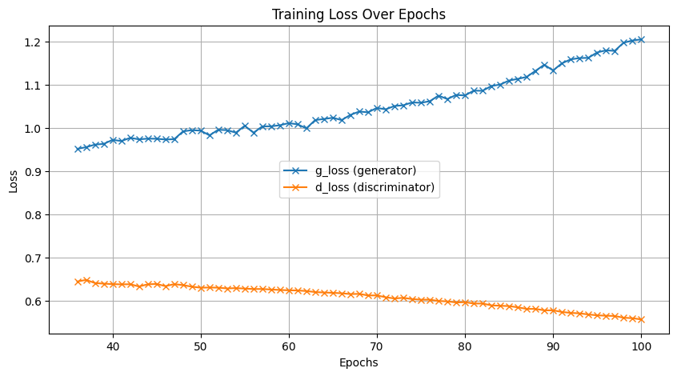

# Overview

This repository contains a [Jupyter Notebook](./code-demo-gan.ipynb) demonstrating the implementation and usage of Generative Adversarial Networks (GANs). The notebook guides users through the process of setting up the environment, preparing data, building generator and discriminator networks, GAN models, training them, and generating results.

Original implementation please refer to [Deep Learning with Python, 2nd Edition (Manning Publications)](https://www.manning.com/books/deep-learning-with-python-second-edition?a_aid=keras&a_bid=76564dff), chapter 12 Generative Deep Learning, section Generative Adversarial Network.

# Table of Contents

1. [Introduction](#introduction)
1. [Setup](#setup)
1. [Data Preparation](#data-preparation)
1. [Model Building](#model-building)
1. [Training](#training)
1. [Results](#results)
1. [References](#references)
1. [Brief Usage Instruction](#brief-usage-instruction)

## Introduction

This is the coursework for the subject "Seminar Current Topics in AI" under the [B.Sc. Artificial Intelligence](https://www.th-deg.de/ki-b) program at [Deggendorf Institute of Technology](https://www.th-deg.de/). During the course, I will be demonstrating and explaining the implementation of Generative Adversarial Networks (GANs).

## Setup

To begin, I highly recommend users to mount their Google Drive to save models, generated images, and track progress. This is particularly useful when working in Google Colab.

> <b>In later sections, users will need to replace the directory path to suit their own needs.</b>

## Data Preparation

This section includes steps to prepare the dataset required for training the GAN, such as downloading the dataset, preprocessing and perform normalization to ensure your data is properly organized and accessible.

## Model Building

In this section, users will construct the architecture of the GAN, including the generator and discriminator networks. Users may of course design their own networks' layers. However due to restriction from my computational power, I stuck with the setting provided from the book. Once the generator and discriminator networks are set up successfully, users will combine both of the networks and build a GAN model.

## Training

Train the GAN model using the provided training loop. This section covers the training process, including how to monitor progress and save checkpoints.

## Results

After training, generate images using the trained GAN model. This section demonstrates how to visualize the results and access the quality of the generated images.

Below are some examples of the generated images from epoch 1, 33, and 101.

### Epoch 1

### Epoch 33

### Epoch 101

### Training Loss Graph

I recorded the training loss for both the generator and discriminator networks from epoch 36 to 100. However, the generator's training did not go as well as expected, with the loss increasing significantly after the 50th epoch.

## Brief Usage Instruction

- Please replace any directory path to suit to users' own needs.
- Under [model-checkpoint](./resources/model-checkpoint/), users can find some model checkpoints. These checkpoints can be used in the model inference section of the notebook or to continue training from the saved point.
